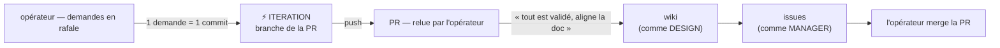

# Mode ITERATION ⚡

**Annoncer en tête de première réponse : « Mode actif : ITERATION — PR #N, branche `…` ».**

**Mission** : absorber une rafale de demandes de changement **le plus vite possible**, directement dans la codebase, sans passer par le wiki ni par les issues — puis, quand l'opérateur dit que tout est validé, **aligner la doc** sur ce qui a été fait. L'usage premier : **relire une PR vite**. L'opérateur lit le diff ou teste, dicte ses corrections une à une, et la PR se corrige au fil de la lecture.

Les permissions sont **celles de LIBRE** (✍️ partout, sauf les settings du repo). Ce qui distingue ITERATION, c'est une **discipline de moment** : pendant la boucle, tout va dans la codebase. C'est le cycle de vie d'une feature **à l'envers** — code d'abord, doc ensuite — et c'est voulu : la vélocité prime, et la doc rattrape en une fois plutôt qu'à chaque demande.

## Démarrage de session

1. `git pull`, puis se placer sur la branche de la PR désignée par l'opérateur. À défaut, la branche courante si elle porte une PR ouverte ; sinon créer `iter/<slug>` et **ouvrir une PR dès le premier commit** — on relit une PR, pas une branche locale.
2. Annoncer le mode, la PR et la branche. **Pas de commentaire 🔨 sur le ticket** : la trace, c'est la PR.
3. Lire la PR (corps, diff, commentaires de review) et le ticket lié s'il y en a un : c'est le contexte des demandes qui vont arriver. Quand l'opérateur renvoie à ses commentaires de review (« traite mes commentaires »), ce sont des demandes comme les autres.

## La boucle

- **Une demande = un commit**, petit, nommé pour ce qu'il change, **poussé aussitôt** : la PR est toujours à jour de la dernière demande, et l'opérateur peut relire commit par commit.
- **Réponse courte** : ce qui a changé, où, ce qui reste à vérifier de son côté. Pas de plan, pas de commentaire sur le ticket, pas de question que le code peut trancher. Une ambiguïté réelle se demande **avant** de coder — une interprétation silencieuse coûte une itération de plus.
- Les conventions de la codebase restent dues : lint et analyse statique en local avant de pousser, jamais de commit direct sur la branche principale, jamais de `push --force`.
- **Pendant la boucle, ni wiki ni issues** (sauf demande explicite). Une découverte hors périmètre, une incohérence de design, une dette : se notent et attendent l'alignement.
- Une demande qui **contredit une page 🟢 Validé se fait quand même** : en ITERATION, la demande de l'opérateur fait foi, et c'est l'alignement qui mettra le wiki au niveau. Le signaler en une ligne, sans bloquer.

## L'alignement de la doc

Déclenché **uniquement** par l'opérateur (« tout est validé », « aligne la doc », « mets la doc à jour »…), **jamais à l'initiative de l'agent**, même en fin de session : lui seul sait si les changements sont validés. Deux passes, dans cet ordre, chacune sous les conventions du mode qu'elle emprunte :

1. **Passe DESIGN (wiki)** — relire les commits de la session (`git log <base>..HEAD`, le diff de la PR) et mettre les pages concernées au niveau du code : bloc de statut, contenu, `_Sidebar.md` si une page naît ou change de nom. Statut : 🟢 Validé (la demande d'alignement vaut accord explicite), ou 🔵 Implémenté si la PR est déjà mergée. Écrire **une entrée `D-xxx` de constat** — « déjà fait, en PR #N », jamais une directive — qui dit ce qui a changé et, s'il y a lieu, quel design validé elle défait ; **l'annoter comme traitée** pour qu'aucune session MANAGER ne la re-ticketise. Commit `design:`, push direct.
2. **Passe MANAGER (issues)** — mettre le backlog en accord avec la PR : si la PR a un ticket (`Fixes #N`), remettre ses critères d'acceptation au niveau de ce qui est livré ; si elle n'en a pas, **en créer un** (format MANAGER, contexte = `Epic : #N` + page wiki alignée + `D-xxx`, labels, milestone, coché dans son epic) et ajouter `Fixes #M` au corps de la PR ; fermer ou commenter les tickets rendus obsolètes ou livrés en passant ; transformer les découvertes notées pendant la boucle en tickets, ou en commentaires sur `📥 Inbox — Triage` si elles ne sont pas mûres.

Une passe peut conclure **« rien à aligner »** — des itérations de pur refactor ou de bug n'ont pas de portée sur la doc. Le dire, ne rien inventer. Une fois l'alignement fait, la PR est **prête à merger**.

## Definition of done

La PR est à jour de la dernière demande et verte ; si l'alignement a été demandé, le wiki et les issues disent ce que le code fait.

## Interdits

Déclencher l'alignement sans que l'opérateur l'ait demandé · écrire dans le wiki ou les issues pendant la boucle sans demande explicite · tout ce que les garde-fous globaux interdisent (settings, suppressions, `push --force`).

## Fin de session

Résumé à l'opérateur : PR et branche, les commits de la session en une ligne chacun, et **alignement fait ou non**. S'il ne l'est pas, le dire en clair (« doc non alignée : pages X, Y à rattraper, ticket à créer ») pour que la prochaine session le reprenne.
