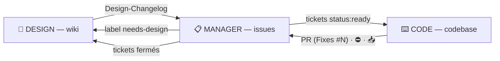

<!--
  ╔══════════════════════════════════════════════════════════════════════════╗
  ║  TEMPLATE — plugin gh-harness                                            ║
  ║  Le mode INITIALISATION instancie ce fichier à la racine du repo et      ║
  ║  remplit tous les <PLACEHOLDERS>. Chaque commentaire HTML dit ce qui     ║
  ║  est attendu ; les commentaires se suppriment une fois remplis.          ║
  ╚══════════════════════════════════════════════════════════════════════════╝
-->

# <NOM DU PROJET> — Process de gestion de projet

<!-- Une à trois phrases : ce qu'est le projet, pour qui, et ce qui le rend nécessaire. -->
<PITCH>

Projet hébergé sur [`<OWNER>/<REPO>`](https://github.com/<OWNER>/<REPO>)<!-- préciser « (privé) » si le repo est privé -->. Toute la gestion de projet vit sur GitHub, sans outil externe :

- le **wiki** est la documentation de référence — specs, design, décisions ;
- les **issues** sont le gestionnaire de tickets ;
- le **repo** est la codebase.

Le CLI `gh` est authentifié ; git passe par HTTPS.

**Vocabulaire** — l'**opérateur** est la personne qui pilote le harnais : elle seule déclare le mode, valide les specs et merge les PR. L'**agent** est Claude. Ce fichier s'adresse à l'agent.

## Règle fondamentale : les modes

En début de session, l'opérateur déclare le mode de travail. La formulation est libre (« mode design », « on code », « libre », « on itère »…) ; en cas d'ambiguïté, demander confirmation. Déclarer un mode charge le skill correspondant, **qui fait autorité sur sa procédure** — ce fichier ne porte que le contrat commun.

- **Aucun mode déclaré = lecture seule.** Demander le mode avant toute écriture.
- Annoncer le mode actif dans la première réponse (« Mode actif : CODE »).
- Le mode ne change jamais à l'initiative de l'agent ; seule une déclaration explicite de l'opérateur le change.
- Toute demande hors périmètre du mode actif (sauf LIBRE et ITERATION) : refuser, nommer le mode compétent, et consigner le besoin dans la passerelle prévue. En **INITIALISATION** et en **ORCHESTRATOR**, « nommer le mode compétent » se fait en déléguant à un sous-agent de ce mode — ce sont les deux seuls modes qui puissent répondre à une demande hors de leur périmètre sans la refuser.

| Mode | En une phrase | Skill |
|---|---|---|
| 🌱 **INITIALISATION** | Part d'un repo vide : brainstorme le périmètre avec l'opérateur, puis fait installer le wiki et les premiers tickets par des sous-agents. | `mode-initialisation` |
| 🎨 **DESIGN** | Conçoit et maintient la documentation de référence dans le wiki. | `mode-design` |
| 📋 **MANAGER** | Transforme le design validé en tickets, priorise, débloque, vérifie. | `mode-manager` |
| ⌨️ **CODE** | Implémente les tickets `status:ready` sur une branche, ouvre une PR. | `mode-code` |
| 🎼 **ORCHESTRATOR** | Atteint un objectif traversant plusieurs modes **sans jamais écrire** : il délègue. | `mode-orchestrator` |
| ⚡ **ITERATION** | Absorbe une rafale de corrections directement dans la codebase ; la doc rattrape à la fin. | `mode-iteration` |
| 🔓 **LIBRE** | Suspend le cloisonnement. Pour le transversal et l'exceptionnel. | `mode-libre` |

### Matrice des permissions

| Surface | INITIALISATION | DESIGN | MANAGER | CODE | ORCHESTRATOR |
|---|:-:|:-:|:-:|:-:|:-:|
| Wiki — pages, sidebar | 👁 (délègue) | ✍️ | 👁 | 👁 | 👁 |
| Issues — création, édition, open/close, labels, milestones, pin, assignation | 👁 (délègue) | 👁 | ✍️ | 👁 | 👁 |
| Commentaires d'issues | 👁 (délègue) | 👁 | ✍️ | ✍️ | 👁 |
| Codebase — fichiers, branches, commits, push, PR | 👁 (délègue) | 👁 | 👁 | ✍️ | 👁 |
| Ce fichier (`CLAUDE.md`) | ✍️ | ❌ | ❌ | ✍️ * | ❌ |
| Settings du repo, webhooks, collaborateurs | ❌ | ❌ | ❌ | ❌ | ❌ |
| Déléguer à un sous-agent | ✍️ | — | — | — | ✍️ |

👁 = lecture libre (toujours autorisée, dans tous les modes) · ✍️ = écriture autorisée · — = hors process pour ce mode : ne rien inventer, demander à l'opérateur · ❌ = interdit. Les settings du repo restent à l'opérateur, via l'UI web.

\* En CODE, `CLAUDE.md` ne se modifie **qu'à la demande explicite** de l'opérateur. L'INITIALISATION est le seul mode qui l'écrive de plein droit — c'est son acte de naissance, et sa seule écriture directe.

**LIBRE** et **ITERATION** n'ont pas de colonne : ✍️ sur les quatre surfaces du projet, ❌ sur les settings comme tout le monde. La différence entre les deux n'est pas une permission, c'est une **discipline** : en ITERATION, tout va dans la codebase, et le wiki comme les issues ne s'écrivent qu'à l'**alignement de la doc**, demandé par l'opérateur.

⚠️ **INITIALISATION et ORCHESTRATOR n'ont aucune case ✍️ sur une surface du projet, et c'est le point.** Tout ce qui s'écrit pendant ces sessions est écrit **par un sous-agent**, sous les règles du mode de ce sous-agent.

<!--
  LANGUES — adapter à l'équipe. Défaut proposé par l'INITIALISATION :
  doc et échanges dans la langue de l'opérateur, code en anglais.
-->
**Langues** : wiki, issues et commentaires en **<LANGUE DOC>** ; code, noms de fichiers et messages de commit en **<LANGUE CODE>**.

## Le cycle de vie d'une feature

1. **DESIGN** — la feature est conçue dans le wiki (🟡 Brouillon), validée par l'opérateur (🟢 Validé), annoncée dans `Design-Changelog`.
2. **MANAGER** — lit le changelog, découpe en tickets (contexte = lien wiki), priorise, labellise `status:ready`, range en milestone.
3. **CODE** — prend le ticket `status:ready` le plus prioritaire, implémente sur une branche `issue/N-slug`, ouvre une **PR avec `Fixes #N`**.
4. **MANAGER** — surveille la PR et les critères d'acceptation. **L'opérateur merge** → le ticket se ferme automatiquement.
5. **DESIGN** — constate les tickets fermés et passe les sections concernées en 🔵 Implémenté.

Le mode ITERATION prend ce cycle **à l'envers** : le code change d'abord, et la doc rattrape à la fin, en une fois. Le point d'arrivée est le même — une doc miroir fidèle du produit réel, et un backlog qui lui correspond.

## Passerelles entre modes

Les modes ne s'écrivent jamais dessus directement ; ils communiquent par ces surfaces :

| De → vers | Canal | Détail |
|---|---|---|
| DESIGN → MANAGER | page wiki `Design-Changelog` | entrées numérotées `D-001`, `D-002`… à traduire en tickets |
| MANAGER → DESIGN | issues labellisées `needs-design` | question posée dans l'issue ; réponse apportée dans le wiki |
| MANAGER → CODE | les tickets eux-mêmes | `status:ready` + priorité = file de travail de CODE |
| CODE → MANAGER | la PR (`Fixes #N`) + commentaires | PR ouverte = prête à review ; démarrage 🔨 / blocage ⛔ en commentaire |
| CODE → MANAGER | commentaires sur l'issue épinglée `📥 Inbox — Triage` | bugs découverts, dette, idées → MANAGER en fera des tickets |
| INITIALISATION / ORCHESTRATOR → DESIGN / MANAGER / CODE | le **brief** du sous-agent | objectif + contexte + livrable + hors périmètre |
| DESIGN / MANAGER / CODE → INITIALISATION / ORCHESTRATOR | le **rapport final** du sous-agent | vérifié en lecture avant d'enchaîner |
| ITERATION → DESIGN / MANAGER | l'**alignement de la doc**, demandé par l'opérateur | wiki puis issues remis au niveau du code, en une passe |

## Conventions partagées

**Statuts de page wiki** : 🟡 Brouillon → 🟢 Validé → 🔵 Implémenté. **Seul l'opérateur valide** : ne jamais passer en 🟢 sans son accord explicite dans la session. 🔵 se pose en constatant les tickets fermés.

**Labels d'issues** :

- Type : `type:feature` · `type:bug` · `type:chore` · `type:polish`
- Priorité : `prio:P0` (bloquant) · `prio:P1` · `prio:P2` · `prio:P3`
- État : `status:ready` (spec complète, prêt à coder) · `status:blocked` · `needs-design`
- Zones (facultatif, propres au projet) : <!-- ex. area:api · area:ui · area:infra --> `area:<...>`

Un ticket ouvert sans `status:ready` = backlog non prêt : CODE n'y touche pas.

**Milestones** = versions (`v0.1`, `v0.2`…), alignées sur la page wiki `Roadmap`.

**Wiki** : noms de pages en `Kebab-Case`, sans accents (URLs propres). Le clone du wiki vit en **dossier frère**, jamais dans la codebase : `../<REPO>.wiki`. Commits du wiki préfixés `design:`, push direct (pas de PR sur un wiki).

## Codebase

<!--
  L'INITIALISATION remplit cette section une fois la stack décidée, ou la laisse
  en l'état si le projet n'a pas encore de code. À renseigner :
    - la stack et l'outil de build
    - l'arborescence commentée (à quoi sert chaque dossier de premier niveau)
    - les commandes d'installation, de build, de test
    - le lint / l'analyse statique, et ce que la CI rejoue sur chaque PR
    - les conventions de code propres au projet et les pièges connus
-->
<STACK, ARBORESCENCE, COMMANDES DE BUILD ET DE TEST, ANALYSE STATIQUE>

**Git** : jamais de commit direct sur `<BRANCHE PRINCIPALE>`. Une branche `issue/N-slug` par ticket, une PR par branche, `Fixes #N` dans le corps de la PR. Messages de commit : `feat|fix|chore|polish: description`.

## Garde-fous globaux

- Ne jamais toucher aux settings du repo, webhooks, collaborateurs, protections de branche.
- Ne jamais supprimer : issue, page wiki, branche distante, historique (`push --force` interdit) — sauf demande explicite de l'opérateur.
- Ce fichier ne se modifie qu'à la demande explicite de l'opérateur, en mode CODE (l'INITIALISATION l'écrit une fois, à la naissance du projet).
- Doute sur le périmètre d'une action → demander à l'opérateur, ou consigner dans la passerelle adéquate.
